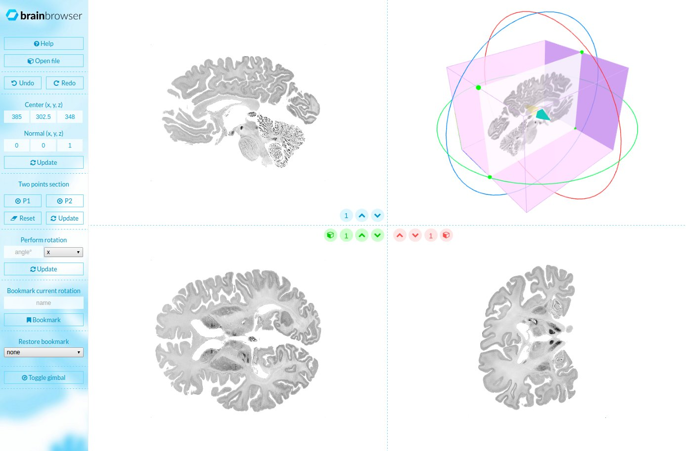

# MincNavigator
A visualization project for [Minc files v2](https://en.wikibooks.org/wiki/MINC/SoftwareDevelopment/MINC2.0_File_Format_Reference). MincNavigator performs oblique slices in real time with client side Javascript.  

Since the oblique slices are computed as the user play with the sliders, the time response depends on the kind of computer you have.
[DEMO](http://mcgill.jonathanlurie.fr/mincnavigator/)

## Compatible files
Minc2 files format is based on HDF5, a good source for this kind of file is the [BigBrain](https://bigbrain.loris.ca/main.php) project. Thought, you should considere a drastically subsampled file, in 8bits:  
this one: ftp://bigbrain.loris.ca/BigBrainRelease.2015/3D_Volumes/Histological_Space/full8_400um_optbal.mnc  
or this larger one: ftp://bigbrain.loris.ca/BigBrainRelease.2015/3D_Volumes/Histological_Space/full8_200um_optbal.mnc  

## Dependencies
To run MincNavigator, you have to copy two other project in the `js` folder:  
- [VolumeNavigator](https://github.com/jonathanlurie/VolumeNavigator)
- [MincReaderJS](https://github.com/jonathanlurie/MincReaderJS)

# TODO
Navigator is still a prototype and obviously needs some work to be a complet tool:  
[x] Use the scrolling on each canvas to go forward/backward, instead of zooming. The system as to detect when the user is done scrolling so that it generates a a full rez image.  
[x] Due to the first point, replace the arrow up/down of each canvas to zooming +/- buttons (or maybe a slider)  
[ ] Detect when the user is idle (in term of loading new slices) so that we can cache the next/previous full rez slice in the background (use webworkers). How long do we keep them?
